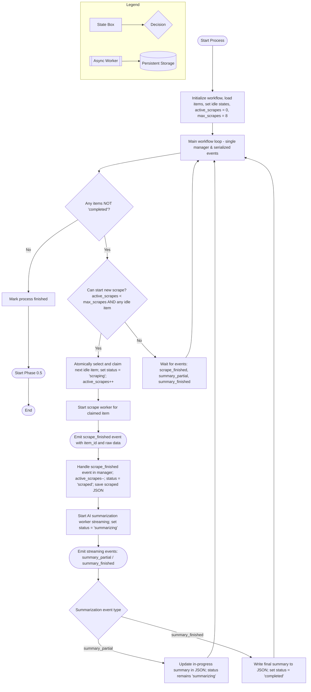

### Scraping → Summarization Workflow Manager v3 (No-Race-Condition Design)

This document describes the v3 workflow manager for the scraping → summarization pipeline.  
The design assumes **a single authoritative workflow manager** that:
- Maintains item state (`idle` → `scraping` → `scraped` → `summarizing` → `completed`)
- Enforces the **max 8 concurrent scrapes** rule
- Serializes all state transitions (via a single event loop or equivalent locking) to avoid race conditions.

### High-Level Flowchart (Mermaid)

 ### Main Loop Behavior (How New Scrapes Keep Starting)
 
 - The `MAIN_LOOP` is a true loop in the workflow manager (e.g., `while process_not_finished:`).
 - On each iteration, it:
   - Checks whether all items are `completed`. If yes, it finishes and starts Phase 0.5.
   - If not finished, it evaluates `CHECK_START_SCRAPE`:
     - If `active_scrapes < max_scrapes` **and** there is at least one `idle` item, it immediately claims a new item and starts a scrape worker.
     - Otherwise, it executes `WAIT_EVENTS`, which:
       - Blocks until there is at least one event **or** a short timeout (e.g., 100–500 ms).
       - Returns control to `MAIN_LOOP`, which again re-checks `CHECK_START_SCRAPE`.
 - This means the manager is **continuously re-evaluating** whether it can start new scrapes—either in response to events (like `scrape_finished`) or periodic wake-ups—so it never gets stuck in a "wait and nothing happens" state as long as there are idle items available.
 
 ### Race-Condition Avoidance (Key Rules)

- **Single owner of state**: All changes to item status, `active_scrapes`, and JSON metadata happen **only in the workflow manager**, never directly inside workers.
- **Atomic claim for scraping**: When starting a scrape, the manager:
  - Selects exactly one `idle` item (e.g., `SELECT ... FOR UPDATE`, or in-memory lock).
  - Immediately marks it `scraping` and increments `active_scrapes` before launching the worker.
  - Persists this change so no second manager instance can claim the same item.
- **Serialized event handling**:
  - `scrape_finished`, `summary_partial`, and `summary_finished` events are processed **one at a time** by the manager (via a single-threaded loop, queue, or equivalent locking).
  - Each event handler re-checks the current item state (idempotent updates) before applying changes.
- **No direct cross-talk between workers**:
  - Scrape workers only emit `scrape_finished` events.
  - Summarization workers only emit streaming / final events.
  - Workers never modify `active_scrapes` or item lifecycle flags.
- **Termination is safe**:
  - The process completes only when **all items are `completed`** and no further events are pending.
  - After that, the manager marks the entire process finished and **starts Phase 0.5**.

### Summary of Required States per Item

- **`idle`**: Not yet scraped, eligible to be claimed if `active_scrapes < 8`.
- **`scraping`**: A scrape worker is running for this item. It cannot be claimed again.
- **`scraped`**: Scrape finished, JSON saved; item is ready for summarization.
- **`summarizing`**: Summarization is active and may be streaming partial results.
- **`completed`**: Final summary written to JSON; item fully done.

This diagram and state model are designed so that once implemented with a single authoritative manager (or a strongly-consistent lock around its responsibilities), **no race conditions** should occur in the scraping → summarization process.

